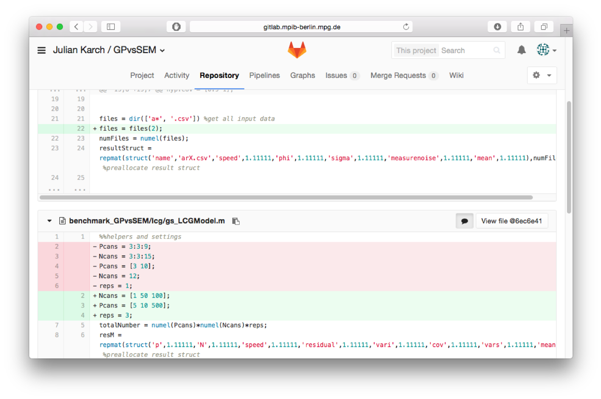
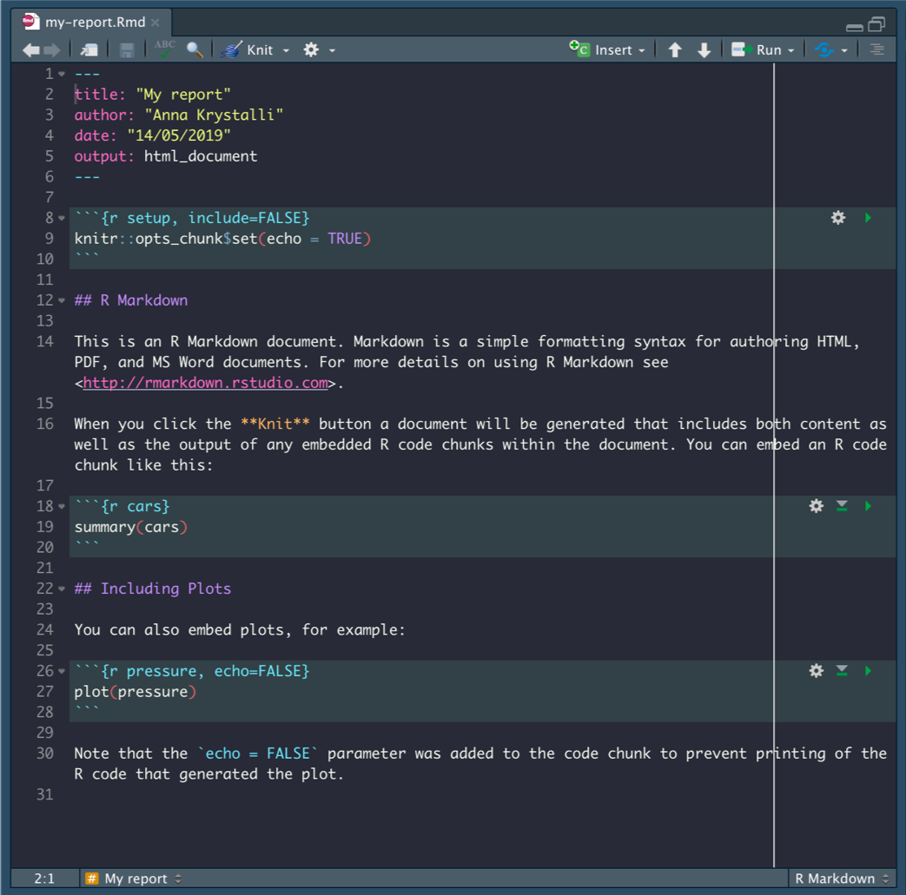
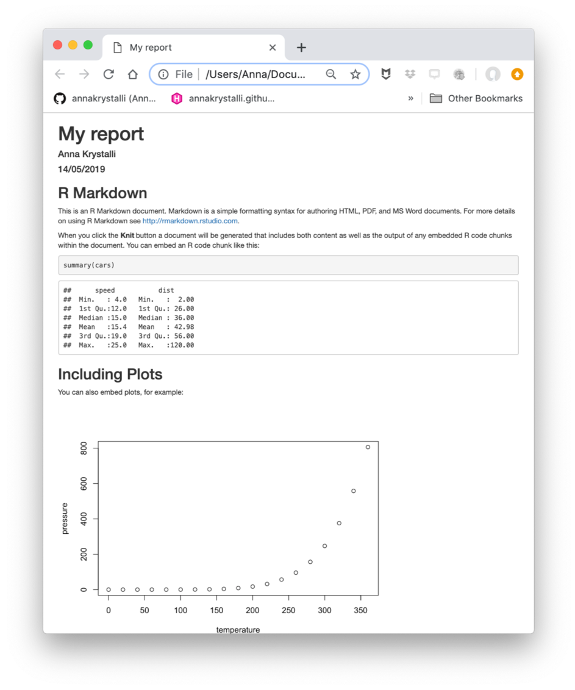
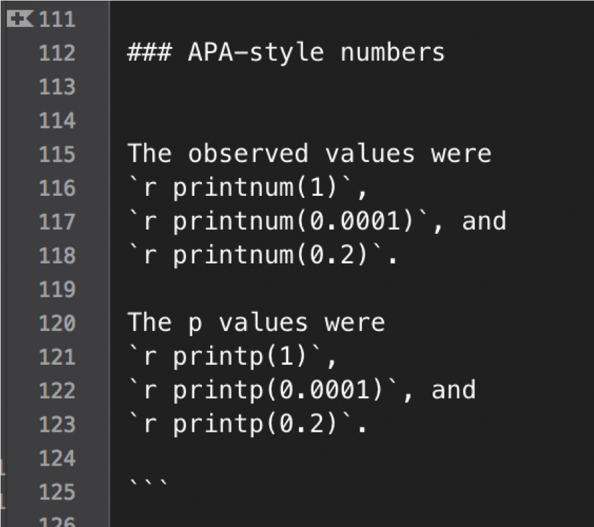
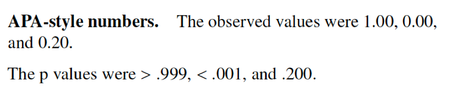
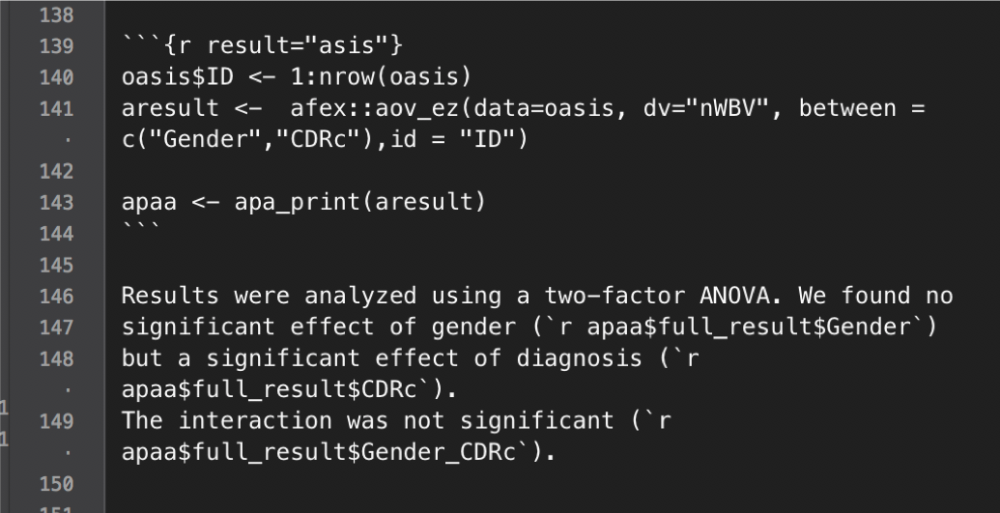
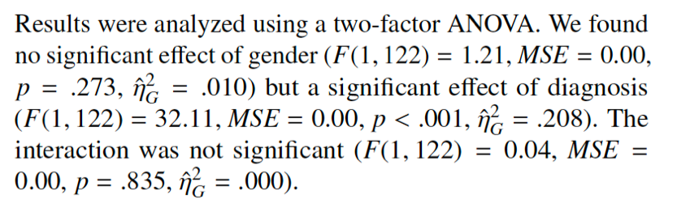

```{r setup, include=FALSE}
options(htmltools.dir.version = FALSE)
```

class: clear
background-image: url(images/screenshot_preprint_repro.png)
background-size: contain

---

class: clear middle center large

## Your closest collaborator is you six months ago, but you don’t reply to emails.

.footnote[From Karl Broman's lecture on reproducibility, paraphrasing Mark Holden]

---

# Sources of Failure to Reproduce Results

.pull-right[  ]

1. *Multiple versions of scripts/data* (e.g., dataset has changed over, i.e., was further cleaned or extended)

--

2. *Multiple scripts* in a pipeline; unclear which scripts should be executed in which order

--

3. *Copy&paste errors* (e.g., inconsistency between reported result and reproduced result)

--

4. Broken *software dependencies* (e.g., analysis broken after update, missing package)


---

background-image: url(images/nutshell.svg)
background-size: contain
background-size: 90% 90%
background-position: center

# Four Elements of Reproducibility

---

class: left, middle, inverse
background-image: url(http://3.bp.blogspot.com/-c7bI_n5oXd0/U7vTYArmRoI/AAAAAAAAKoQ/3JkxLM2PRKo/s1600/gospels-meme.jpg)
background-position: right

<!-- -----------------------------

Part: Version Control

--------------------------------- -->

# Version Control

---

# Version Control

### Version Control

- Version control system (VCS) records changes to a set of files over time so that you can restore specific versions
later.

- VCS guarantee that code and data are exactly the same
version as used for publication.

- Reduces the number of dead or dysfunctional code lines (deletion is safe and branches help separate productive and experimental code)



---

class: clear
background-image: url(images/screenshot_github_releases.png)
background-size: contain

# Releases

---

# Long-Term Storage

- GitHub has no long-term guarantuees for availability of their service

--

- (even though they do LOCKSS, for Lots Of Copies Keeps Stuff Safe, e.g., the Artic World Archive)

--

- Mirror snapshots with meta-data and DOI to other providers (e.g., Zenodo, FigShare, OSF)

---

background-image: url(images/claudio-schwarz-purzlbaum-qjX0QBtDXto-unsplash.jpg)
background-size: cover
background-position: right top
class: left, middle, inverse, clear


# <br><br><br><br><br>Dependency Management


---

background-image: url(https://www.gnu.org/graphics/empowered-by-gnu.svg)
background-size: 20% 38%
background-position: right top

# GNU Make


### Challenge

What files are executable and in which order are they to be executed?

--

### Solution: Makefile


- contains a number of recipes
- Each recipe contains its dependencies and commands to create a product
- There is a default recipe (defined entry point)
- There is an „all“ recipe to create everything 
- Recipes can depend on other recipes and files

---

# Example Makefile

### Makefile Schema

```{bash, eval=FALSE}
recipe name: ingredients
  instructions
```

--

### An example Makefile
```{bash, eval=FALSE}
all: manuscript.pdf

manuscript.pdf: data/iris_prepped.csv manuscript.Rmd
  Rscript -e 'rmarkdown::render("manuscript.Rmd")'

data/iris_prepped.csv: R/prepare_data.R data/iris.csv
  Rscript -e 'source("R/prepare_data.R")'
```

--

Further examples: download a remote file, remove lines from a file using `sed` stream editor, correct faulty data entries, call an external program, etc.

---
class: left, middle, inverse
background-image: url(https://www.docker.com/sites/default/files/d8/2019-07/horizontal-logo-monochromatic-white.png)
background-position: right

<!-- -----------------------------

Containerization

--------------------------------- -->

# Containerization
---

background-image: url(https://www.docker.com/sites/default/files/d8/2019-07/Docker-Logo-White-RGB_Vertical.png)
background-position: top, right
background-size: 50% 50%

# Docker

Docker is a shareable virtual machine that runs identically on any computer (Linux, macOS, Windows)

- You can either provide a short recipe how to create a container (few kilobytes) or 
- the entire container (few gigabytes)

--

Recipes are machine-readable instructions how to create a container from publicly available sources, e.g., 

-   Rocker project (Boettiger & Eddelbuettel, 2017), with pre-configured Docker images including R/Rstudio
-   Microsoft R Application Network (MRAN) providing CRAN snapshots in their „time machine“

```{bash, eval=FALSE}
FROM rocker/verse:3.6.1
ARG BUILD_DATE=2019-11-11
RUN install2.r --error --skipinstalled here lavaan
WORKDIR /home/rstudio
```

---

# The easy way

- The R package `renv` helps you to set up and restore project-specific local environments in R

- Create a private R library with `renv::init()` (the project will now always rely on the local library)

- Update a library with `renv::snapshot()` 

- Restore a library with `renv::restore()` 

.footnote[cf. the WORCS approach by van Lissa et al. (2020)]

### But is this really enough?

---

# Examples of Non-Reproducible Code in R

Here are some examples of non-reproducible code that cannot be captured easily from within a given R environment

### 1.	Bugfix in random number generator in R between R 3.5 and R 3.6

```{r eval=FALSE}
set.seed(1234); 
sample(1:10, 5) 
```

--

```{r eval=FALSE}
2 6 5 8 9 (R3.5)
```

--

```{r eval=FALSE}
10 6 5 4 1 (R3.6.1)
```
--

---

# Examples of Non-Reproducible Code in R

---

#  Examples of Non-Reproducible Code in R
	
### 2.	Locale-dependent behavior (e.g., English vs Lithuania):

````{r eval=FALSE}
sort(state.abb) 

[1] "AK" "AL" "AR" "AZ" "CA" "CO" "CT" "DE" "FL" "GA" "HI" "IA" 
[13] "ID" "IL" "IN" "KY" "KS" "LA" "MA" "MD" "ME" "MI" "MN" "MO" 
[25] "MS" "MT" "NC" "ND" "NE" "NH" "NY" "NJ" "NM" "NV" "OH" "OK" 
[37] "OR" "PA" "RI" "SC" "SD" "TN" "TX" "UT" "VA" "VT" "WA" "WI" 
[49] "WY" "WV"
```

---

# Docker

#### Docker is basically a shareable virtual machine that runs identically on any computer (Linux, macOS, Windows)

Sharing a container:

- the entire _container_ (few gigabytes)
- using a short _recipe_ how to create a container (few kilobytes), or


With recipes, we provide machine-readable instructions how to create a container from publicly available sources, e.g., 
Rocker project (Boettiger & Eddelbuettel, 2017), with pre-configured Docker images including R/Rstudio
Microsoft R Application Network (MRAN) providing CRAN snapshots in their „time machine“

---

# Containers

### Docker containers 

- guarantee identical execution of its contents across platforms (and time) 

--

- can run interactively: R/Rstudio can run in the container (i.e., there is no need to ever run the analysis in your local computing environment)

--

- Analyses can be run in different containers (simulating different package versions) to find out what downstream updates broke your code / your results


---

class: left, middle, clear
background-image: url(images/neven-krcmarek-V4EOZj7g1gw-unsplash.jpg)
background-position: right middle
background-size: cover

<!-- -----------------------------

Part: Dynamic Document Generation

--------------------------------- -->

# <br><br><br><br><br>Dynamic Document<br>Generation

---

# R Markdown Example

.pull-left[

]
..pull-right[

]
---

# Number reporting (APA style)

.pull-left[

]

.pull-right[


]

---

# Reporting statistics with papaja

.pull-left[ ]
.pull-right[ ]

---


# The `repro` package

Takes care of all tedious and error-prone tasks:

--

- manages your Container file

--

- manages your Makefile

---

# YAML header (R Markdown)

`repro` extends the YAML header of R Markdown to track dependencies on _packages_, _scripts_, and _data_.

```{r, eval=FALSE}
---
title: My worst academic fails
author: Andreas Brandmaier
date: 2020-11-17
output: html_document
---
```

---

# YAML header (repro)

`repro` extends the YAML header of R Markdown to track dependencies on code and data.

```{r, eval=FALSE}
---
title: My worst academic fails
author: Andreas Brandmaier
date: 2020-11-17
repro:
  packages:
    - usethis
    - fs
    - aaronpeikert/repro@d09def75df
  scripts:
    - R/clean.R
  data:
    mycars: data/mtcars.csv
output: html_document
---
```


---

# System setup with `repro`

Load the package:

```{r echo=TRUE,eval=TRUE, message=FALSE}
library(repro)
```

Run some checks:

```{r}
check_git()
check_make()
check_docker()
```

---

# Project setup with `repro`

- Either add components with commands such as `use_make()` or `use_docker()` or `use_git()`

- Use `repro::automate()` adds all components:

  - creates a Dockerfile & Makefile based on every RMarkdown in the project folder

  - prepares YAML header

---

# Reproduction

```{r eval=FALSE}
rerun(cache = FALSE)
```

The argument `cache = FALSE` ensures that everything that can be recreated
is recreated even when nothing was changed.

---

class: center inverse
background-image: url(images/feng-HO2GGotLtgs-unsplash.jpg)
background-size: contain

# Live Demo


---

# Outlook

	
#### Long-term sustainability is a continuing challenge for the community

We need academic repositories for scientific software/environments that

- are freely accessible (no commercial interests)
- guarantee long-term reproducibility (independent of short-term grants)
- provide software infrastructure and computational environments

---

# Thank you!

If you want to know more:

  - Ask us a question via a [github issue](https://github.com/aaronpeikert/repro/issues)
  - Follow [@brandmaier](https://twitter.com/brandmaier) on twitter
  - Read our [preprint](https://psyarxiv.com/8xzqy/)
  - Check our [repro](https://github.com/aaronpeikert/repro) repository on GitHub
  - Read Aaron's [slides on repro](https://github.com/aaronpeikert/repro-talk)


---

# License Information

- This presentation is distributed under CC-BY 4.0
- The ananas image on the title and other unsplash images were provided under the Unsplash License.
- The GNU logo was provided under the Free Art License.

---